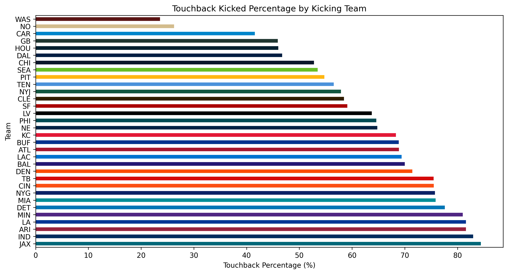
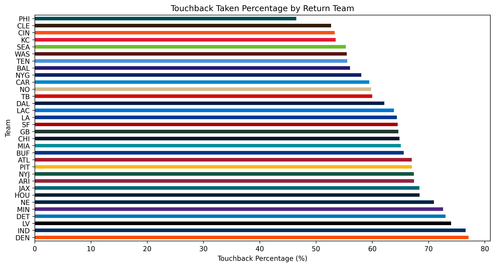
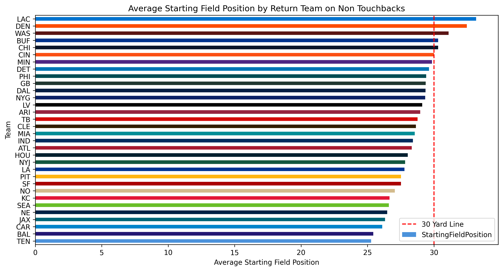
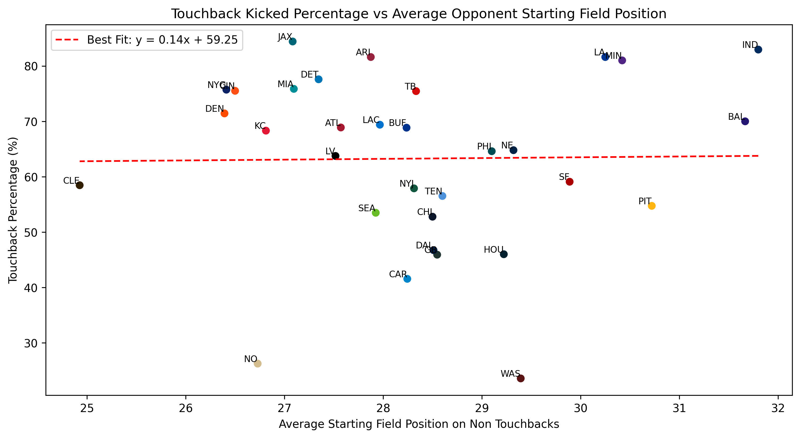
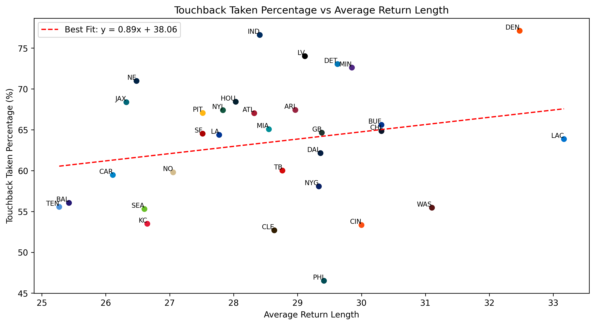
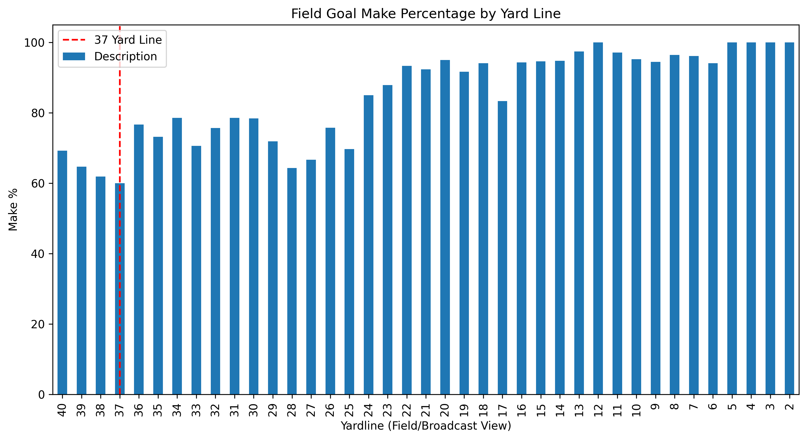
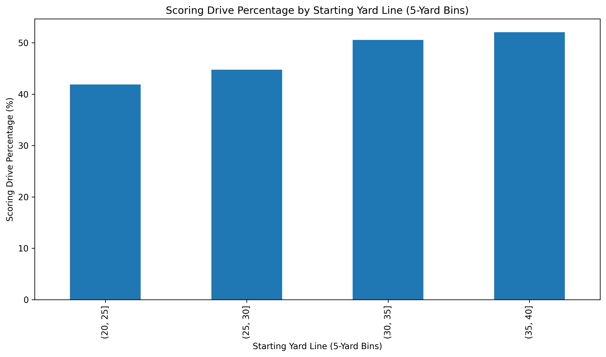

# New NFL Kickoff Data Analysis

Analyze how the 2024 kickoff rule changes impacted return rates and field position.

## Questions
- Did the new rule lead to more returns?
- How do the average starting field position of returned kicks compare with touchbacks? Is there more of an advantage to the kicking team to force a return?
- How does the average starting field position affect the amount of points scored on that drive?

## Data
This project expects a CSV at:
`data/raw/pbp-2024.csv`

(That file is not committed to the repo.)

## Quickstart
```bash
python -m venv .venv
source .venv/bin/activate  # Windows: .venv\Scripts\activate
pip install -r requirements.txt
jupyter notebook
```

## What Changed?

First, We have to define what changed about the NFL Kickoff between 2023 and 2024.  The nfl made these changes due to "unnacceptably high" injury rates on the old play, as well as the record lack of returns that occured in the 2023 season. 

From the NFL's operation website, the changes to the rule are listed as follows:

# Alignment
- All kicking team players other than the kicker will line up with one foot on the receiving team’s B40 yard line
- Kicker cannot cross the 50-yard line until ball touches the ground or player in landing zone or end zone
- The 10 kicking team players cannot move until the ball hits the ground or player in the landing zone or the end zone
- The receiving team will line up as follows:
    - Setup Zone – a 5-yard area from the B35 to the B30 yard line where at least 9 receiving team players must line up
    - At least 7 players with foot on the B35 yard line (restraining line) with alignment requirements (outside numbers, numbers to hashes, and inside hashes)
    - Players not on the restraining line must be lined up in setup zone outside the hash marks
- All players in the setup zone cannot move until the kick has hit the ground or a player in the landing zone or the end zone
- A maximum of 2 returners may line up in the landing zone and can move at any time prior to, or during, the kick

# Landing Zone

- Landing zone is the area between the receiving team’s goal line and its 20-yard line.
- Any kick that hits short of the landing zone – treated like kickoff out of bounds and ball spotted at B40 yard line; play would be blown dead as soon as kick lands short of the landing zone
- Any kick that hits in the landing zone - must be returned
- Any kick that hits in the landing zone and then goes into the end zone – must be returned or downed by receiving team – if downed then touchback to B20 yard line
- Kick hits in end zone, stays inbounds - returned or downed – if downed then touchback to B30 yard line
- Any kick that goes out of the back of the end zone (in the air or bounces) – touchback to B30 yard line


# Results

## Touchback Rates

The first question was straightforward: did the new rule lead to more returns?

Using a simple touchback percentage calculation, I found that 63.3% of kickoffs in 2024 were touchbacks. For comparison, the 2023 touchback percentage was 79.2% ([source](https://www.forbes.com/betting/football/nfl/kickoff-rule-change/#:~:text=Kick%20returners%20avoided%20these%20hits,in%20NFL%20history%20(21.8%25))). After just one year under the dynamic kickoff structure, there was a clear and substantial increase in returned kickoffs.

The rule successfully changed behavior.

To understand whether teams were strategically adjusting, I broke the data down by team — both from the perspective of the kicking team and the return team.



The plot above shows the percentage of the time that teams kicked touchbacks. Some teams, like the Commanders and Saints, rarely kicked touchbacks. Others, like the Jaguars and Colts, kicked touchbacks more than 80% of the time.



From the returning team perspective, nearly every team took touchbacks more than 50% of the time — with the Eagles being a notable exception (and coincidentally, the Super Bowl winner that season). One interesting team is the Broncos, who had the highest touchback taken rate. In later analysis, I found that this return unit also led the league in yards per return, which likely explains why opponents avoided putting the ball in play against them.

Teams may also choose to take frequent touchbacks if their return unit is weak, knowing that the guaranteed field position from a touchback is preferable to risking a short return.

The rule clearly put the ball in play more often. The next question is whether that change meaningfully shifted field position.

---

# Starting Field Position

To evaluate the impact of additional returns, I analyzed average starting field position on non-touchback kickoffs from both the kicking and returning team perspectives.




These plots show how effective teams were at defending kickoff returns and how successful return units were at generating field position.

In 2024, only five teams averaged starting past the 30-yard line on returns. I interpret this as evidence that, for most teams, forcing a return is strategically favorable: on average, the defense gains field position relative to a touchback.

The defensive side shows a similar pattern: only five teams allowed opponents to start past the 30 on average. This reinforces the idea that most teams benefit from putting the ball in play under the current rule structure.

To explore the relationship between return quality and touchback frequency, I plotted the following scatter relationships:





These show a slight but intuitive correlation: teams are less likely to allow strong return units the opportunity for explosive plays. Opponents tend to increase touchback rates against teams with higher average return yards.

While the ball was clearly more in play this season, the league appears to want even fewer touchbacks — which likely motivated the decision to move the touchback starting position to the 35-yard line for the 2025 season. Under that structure, no team would, on average, gain better field position from returning than from taking a touchback. This change effectively forces more kicks into the landing zone, generating even more returns.

At this point, we know the rule increased returns and slightly shifted average starting position. The final question is whether that small shift matters.

---

# It's only a few yards — why does it matter?

To evaluate the importance of starting position, I examined how field position impacts the likelihood of scoring on a drive.

The average drive gains roughly 34 yards. With the average starting field position after a kickoff at the 29-yard line, the typical drive ends around the opponent’s 37-yard line — roughly a 54-yard field goal attempt. That distance sits at the outer edge of most kickers’ reliable range. In other words, the average drive already operates near the threshold between punting and attempting points.

This is where a five-yard difference becomes meaningful.

Moving a drive from the 29 to the 34-yard line does not simply shift the field slightly — it meaningfully increases the probability that an average drive ends within realistic scoring range. While scoring outcomes depend on many contextual factors (offensive efficiency, defensive strength, game script), normalizing across the entire league allows us to isolate the structural effect of starting field position.



To further quantify this relationship, I plotted scoring drive percentage by starting yard line bins.



The results show a clear jump in scoring probability once drives begin past the 30-yard line, with scoring rates exceeding 50% for drives starting beyond the 35.

In isolation, five yards may seem insignificant. But league-wide drive data suggests those yards frequently determine whether a drive ends in a marginal long field goal attempt or a realistic scoring opportunity. Over the course of a season — across hundreds of drives — those marginal shifts compound. In a league defined by narrow margins, five yards is not cosmetic; it meaningfully shifts scoring probability.

The dynamic kickoff rule does not radically transform offensive football. Instead, it subtly moves the average starting point of drives — and that starting point carries measurable consequences.